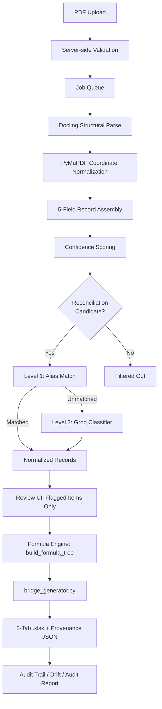
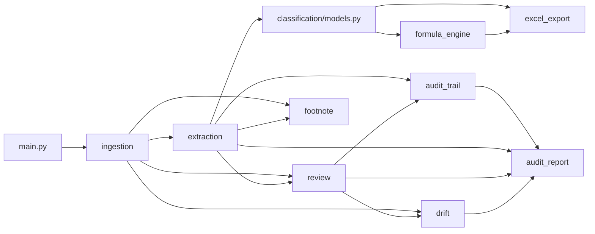

# Footnote

Extract, classify, and spread SEC filings into auditable Excel models with full provenance.

Footnote is a local-first tool that ingests SEC 10-K and 10-Q filings as PDFs, runs layout-aware extraction with bounding-box tracking, classifies line items against a master financial taxonomy, and generates native `.xlsx` workbooks where every derived value is a real Excel formula traceable to its source page and coordinates.

---

## What It Does

1. **Upload** PDFs (drag-and-drop, multi-file). Select a workflow pack at upload time.
2. **Extract** tables with Docling structural parsing + PyMuPDF bounding-box coordinates.
3. **Classify** line items via a two-level pipeline: deterministic alias matching against a 60-80 item Master Financial Taxonomy first, then Groq LLM for genuine unknowns only.
4. **Review** flagged items in a side-by-side PDF + data view. Auto-accepted items are pre-locked; only genuinely uncertain items appear in the review queue.
5. **Generate** a formula-native `.xlsx` workbook with IB-convention formatting (blue = hardcode, black = formula, green = sheet-link) and W3C Web Annotation provenance records.
6. **Audit** any cell back to its source PDF page, bounding box, and extraction chain. Export a full audit report as PDF.
7. **Detect drift** when a company redefines or renames a metric year-over-year.

### Workflow Packs

| Pack | Status | Output |
|---|---|---|
| `non_gaap_bridge` | Complete | 2-tab `.xlsx`: Source_Inputs + Reconciliation (Adjusted EBITDA bridge) |
| `capital_structure` | Wired | 2-tab `.xlsx`: Debt Tranches & Spreads + Lease Waterfall |
| `cash_conversion` | Deferred | Not yet implemented. Upload returns a skip reason. |

---

## Architecture

### Pipeline Flow (non_gaap_bridge)



### Module Dependency Rules



> Module boundaries are enforced as load-bearing isolation rules, not organizational preference. The `classification/` LLM client and dispatcher are fully isolated from all downstream modules. `formula_engine/` functions are pure: no I/O, no clock, no random, no global state. See `docs/CONSTITUTION.md` section 3 for the complete dependency DAG.

---

## Tech Stack

| Layer | Choice | Notes |
|---|---|---|
| Backend framework | FastAPI 0.141 | |
| PDF layout parsing | Docling 2.119 | Requires >= 2 GB RAM; runs locally |
| PDF coordinate utility | PyMuPDF 1.28 | |
| LLM (classification only) | Groq API, `openai/gpt-oss-120b` | Free tier: 30 RPM / 1,000 RPD / 8,000 TPM / 200,000 TPD |
| Formula engine | Custom Python, deterministic pure functions | |
| Excel generation | xlsxwriter 3.2.9 | Creates new workbooks only |
| Graph / state persistence | NetworkX 3.6 + SQLite / JSON | |
| Frontend framework | React 19 + TypeScript | |
| PDF rendering (frontend) | PDF.js (pdfjs-dist 4.10) | `PDF_RENDER_SCALE = 1.5` shared constant |
| Audit report export | ReportLab 5.0 + WeasyPrint 69 | |
| Type checking | mypy 2.3 (`--strict`) | |
| Linting | ruff 0.16, eslint 10 | |
| Testing | pytest 9.1, vitest 4.1 | |
| Build | Vite 8.2 | |

---

## Quickstart

### Prerequisites

- **Python 3.10+** (target version configured in `ruff.toml`)
- **Node.js 20+** (required for Vite 8 and frontend test suite)
- **>= 2 GB RAM** for Docling PDF parsing
- **Groq API key** (free tier is sufficient): [console.groq.com](https://console.groq.com/)

### 1. Clone and set up the backend

```bash
git clone <repo-url> footnote
cd footnote

# Create and activate a virtual environment
python -m venv .venv
# Windows:
.venv\Scripts\activate
# macOS/Linux:
source .venv/bin/activate

# Install Python dependencies
pip install -r requirements.txt
```

### 2. Configure environment

```bash
cp .env.example .env
# Edit .env and set your Groq API key:
# GROQ_API_KEY=your_groq_api_key_here
```

**Environment variables:**

| Variable | Required | Default | Description |
|---|---|---|---|
| `GROQ_API_KEY` | Yes | None | Groq API key for LLM classification |
| `ALLOWED_ORIGINS` | No | `http://localhost:5173,http://localhost:5174` | CORS allowed origins (comma-separated) |

### 3. Start the backend

```bash
python tools/run_backend.py
```

This always runs uvicorn with the `.venv` interpreter. Do not start the server with a bare
`uvicorn` from another Python: without Docling the server refuses to start (set
`ALLOW_PYMUPDF_FALLBACK=1` to run in a degraded, clearly-labelled PyMuPDF mode).
`python tools/run_backend.py --check` reports the interpreter and Docling status.

The API will be available at `http://localhost:8000`.

### 4. Start the frontend

```bash
cd frontend
npm install
npm run dev
```

The UI will be available at `http://localhost:5173`.

### 5. Verify

**Health check:**

```bash
curl http://localhost:8000/health
```

Expected response:

```json
{"status": "ok", "version": "0.1.0", "db_ok": true, "data_dir_writable": true}
```

**API docs:** Open `http://localhost:8000/docs` for Swagger UI or `http://localhost:8000/redoc` for ReDoc.

**Run backend tests:**

```bash
cd backend
pytest
```

**Run frontend tests:**

```bash
cd frontend
npm test
```

---

## Project Structure

```
footnote/
├── backend/
│   ├── app/
│   │   ├── main.py                  # FastAPI entry point, router registration, health check
│   │   ├── job_runner.py            # Pipeline orchestrator across all stages
│   │   ├── model_compilation_service.py  # Cross-layer provenance compilation
│   │   ├── ingestion/               # PDF upload, validation, job persistence, EDGAR client
│   │   ├── extraction/              # Docling parsing, PyMuPDF coordinates, confidence scoring
│   │   ├── classification/          # Taxonomy matching, Groq LLM client, decision logging
│   │   ├── formula_engine/          # Pure-function formula tree construction
│   │   ├── excel_export/            # xlsxwriter workbook generators (bridge, debt, multi-year)
│   │   ├── review/                  # Review state, PDF streaming, confirm/flag/edit actions
│   │   ├── audit_trail/             # Source-chain resolution, cell-to-PDF tracing
│   │   ├── audit_report/            # PDF audit report compilation and rendering
│   │   ├── drift/                   # Cross-year metric drift detection (NetworkX + SQLite)
│   │   ├── footnote/                # Debt schedule and lease schedule extraction (Item 8)
│   ├── data/                        # Runtime data (jobs, extractions, models) — gitignored
│   └── tests/                       # pytest suite (71 test files, mirrors app/ structure)
├── frontend/
│   ├── src/
│   │   ├── App.tsx                  # Root component, job lifecycle, view routing
│   │   ├── components/              # Upload, job list, review, audit, drift, footnote, narrative
│   │   ├── lib/                     # PDF rendering, coordinate math, validation utilities
│   │   └── types/                   # TypeScript type definitions
│   └── package.json                 # React 19, Vite 8, vitest (18 test files)
├── eval/                            # Evaluation harness (FROZEN — no corpus exists)
├── docs/
│   ├── CONSTITUTION.md              # Immutable coding rules and module boundaries
│   ├── spec.md                      # Functional and non-functional requirements
│   ├── plan.md                      # Feature status and phased delivery plan
│   ├── glossary.md                  # Domain term definitions
│   ├── adr/                         # 4 Architecture Decision Records
│   └── ...                          # Business alignment, debugging, fixes, updates
├── requirements.txt                 # Python dependencies (pinned versions)
├── mypy.ini                         # Strict type checking configuration
└── ruff.toml                        # Python linter config (target: 3.10, line-length: 88)
```

---

## Key Engineering Decisions

These trade-offs are documented in `docs/adr/` and `docs/CONSTITUTION.md`:

| Decision | Choice | Rationale |
|---|---|---|
| **2-tab over 6-tab Excel output** ([ADR-002](docs/adr/ADR-002-xlsx-output-format.md), [ADR-003](docs/adr/ADR-003-6tab-generator-freeze.md)) | Default output is Source_Inputs + Reconciliation. The 6-tab multi-statement generator is frozen as beta. | IB-convention formatting. The 6-tab generator was over-engineered for the primary use case (Non-GAAP bridge). Retaining it as an explicit opt-in avoids regressions. |
| **Groq-last classification** ([spec.md](docs/spec.md) Feature 3) | Deterministic alias matching runs first; Groq LLM is called only for genuine unknowns. | Dramatically reduces API token usage (and stays within Groq's free-tier limits). Deterministic path is reproducible and auditable. |
| **xlsxwriter, not openpyxl** ([CONSTITUTION](docs/CONSTITUTION.md) section 4.2) | xlsxwriter generates fresh workbooks only. It cannot edit existing `.xlsx` files. | Intentional constraint. Every regeneration is from scratch, guaranteeing formula consistency (NFR1). Migrating to openpyxl requires an explicit decision. |
| **No auth, no multi-tenancy** ([CONSTITUTION](docs/CONSTITUTION.md) section 6.10) | MVP is single-user, single-session. No billing, no data isolation between users. | Out of scope by design. These are not yet needed and would add complexity before the core pipeline is validated. |

---

## Limitations and Non-Goals

These are deliberate design boundaries, not oversights:

- **Classifier output never touches numbers.** The LLM classifier returns labels only. No code path allows classifier response to populate a numeric cell, formula argument, or table value. (CONSTITUTION section 6.1)
- **No silent failure.** Exceptions in `extraction/` and `formula_engine/` are surfaced as flagged items, never caught and swallowed to keep a pipeline run "green." (CONSTITUTION section 1.9)
- **No auto-merge of taxonomy conflicts.** Unrecognized or conflicting labels are always queued for human confirmation. The review step exists precisely for this. (CONSTITUTION section 6.3)
- **Single-user, local-only MVP.** No authentication, no paid infrastructure dependencies, no multi-tenant data isolation. The system runs within free-tier or local-machine resource limits. (CONSTITUTION section 6.10, NFR4)
- **No data egress beyond Groq.** Raw filing content, filenames, and extracted text are never sent to any remote service beyond the documented Groq classifier call. No telemetry or error-reporting SDKs that transmit document content. (CONSTITUTION section 6.5)
- **Deterministic formula engine.** No random seeds, no wall-clock branching, no unordered iteration affecting output. Identical input filings always produce identical formulas and structure. (NFR1, CONSTITUTION section 6.7)
- **Evaluation harness is frozen.** The `eval/` benchmark corpus does not exist. No ground-truth annotations have been produced. Do not extend the harness until a pilot client confirms the pipeline handles their use case end-to-end.

---

## Documentation

Detailed specifications and governance documents are maintained in `docs/`:

| Document | Purpose |
|---|---|
| [`CONSTITUTION.md`](docs/CONSTITUTION.md) | Immutable coding rules, module boundary enforcement, "Never Do" rules |
| [`spec.md`](docs/spec.md) | Full functional/non-functional requirements, feature specifications, tech stack, architecture |
| [`plan.md`](docs/plan.md) | Feature status matrix, phased delivery plan, technical constraints, resolved decisions |
| [`glossary.md`](docs/glossary.md) | Canonical definitions for financial, extraction, and pipeline terms |
| [`adr/`](docs/adr/) | Architecture Decision Records (ADR-001 through ADR-004) |
