# Footnote — Pipeline Diagnosis & Debugging Plan

This document identifies the root causes preventing `.xlsx` Excel sheet generation from extracted PDFs and provides a structured, ticket-by-ticket remediation plan.

---

## Architecture Overview & Problem Statement

In the Footnote pipeline, PDF extraction proceeds through 8 sequential stages:
1. **Ingestion** (Feature 1) $\to$ **Docling / PyMuPDF Extraction** (Feature 2)
2. **Classification & Seed Taxonomy Normalization** (Feature 3)
3. **Deterministic Formula Engine & Excel Model Generation** (Feature 4)
4. **Extraction Review UI** (Feature 5)
5. **Audit Trail Lookup** (Feature 6) $\to$ **Cross-Year Drift** (Feature 7) $\to$ **Audit Report PDF** (Feature 8)

While isolated unit tests pass on mocked fixtures, the live end-to-end pipeline fails to create `.xlsx` workbooks because of five interrelated problems spanning the classification prompt, strict formula gating, missing review-to-model bridge, and UI action gaps.

---

# Problem 1: Classifier Prompt Lacks Seed Taxonomy & Exact String Matching Fails All Extracted Items

### Problem Description
In [`backend/app/classification/client.py`](file:///c:/footnote/backend/app/classification/client.py), `CLASSIFIER_SYSTEM_PROMPT` asks the Groq LLM to classify line items into standardized non-GAAP reconciliation categories without providing the active seed taxonomy list (`SEED_TAXONOMY`). Consequently:
1. The LLM outputs free-form category names (e.g., `"Share-based compensation expense"`, `"Depreciation and Amortization"`).
2. [`check_label_against_taxonomy`](file:///c:/footnote/backend/app/classification/taxonomy.py#L40-L73) performs an exact, case-sensitive string equality check against `SEED_TAXONOMY` (`"Stock-Based Compensation"`).
3. Exact equality fails for 100% of items, assigning `TaxonomyStatus.pending_taxonomy_confirmation`, `normalized_label = None`, and `is_confirmed = False`.
4. If `GROQ_API_KEY` is not set or network/rate limits occur, all records also fail classification and remain unconfirmed.

### Fix
Inject the active seed taxonomy categories into the classifier prompt and dispatch payload, and provide deterministic fallback matching for offline/no-API-key execution.

---

### Ticket 1.1 — Inject Seed Taxonomy into Classifier Prompt & Payload
* **File:** [`backend/app/classification/client.py`](file:///c:/footnote/backend/app/classification/client.py)
* **Action:**
  1. Update `CLASSIFIER_SYSTEM_PROMPT` to include the standard non-GAAP reconciliation taxonomy categories from `SEED_TAXONOMY`.
  2. Instruct the model: *"You MUST select the most accurate category from the following allowed taxonomy list when applicable: [List of categories]. If no category fits, respond with the closest standard financial category name."*
  3. Ensure the return schema strictly retains `{ "label": string, "confidence": float }` without numeric fields (CONSTITUTION §1.2, §6.2).
* **Acceptance Criteria:** Groq responses select exact seed taxonomy strings for standard reconciliation line items (e.g. `"Stock-Based Compensation"`).

---

### Ticket 1.2 — Add Deterministic Offline / Direct-Match Normalizer Fallback
* **File:** [`backend/app/classification/dispatcher.py`](file:///c:/footnote/backend/app/classification/dispatcher.py) & [`backend/app/classification/normalizer.py`](file:///c:/footnote/backend/app/classification/normalizer.py)
* **Action:**
  1. In `dispatcher.py`, when Groq client raises an API error (missing key, network offline, rate limit), check if the raw extraction label directly maps to a seed taxonomy entry via standard string canonicalization (case-insensitive / whitespace-stripped).
  2. In `normalizer.py`, record the classification result with appropriate confidence so the pipeline does not completely halt when offline.
* **Acceptance Criteria:** Standard line items like `"Stock-based compensation"` or `"Restructuring charges"` map to taxonomy baseline even in offline/demo modes.

---

### Ticket 1.3 — Update Classification Unit & Integration Tests
* **File:** [`backend/tests/classification/test_client.py`](file:///c:/footnote/backend/tests/classification/test_client.py) & [`backend/tests/classification/test_normalizer.py`](file:///c:/footnote/backend/tests/classification/test_normalizer.py)
* **Action:**
  1. Add tests verifying that `CLASSIFIER_SYSTEM_PROMPT` contains seed taxonomy entries.
  2. Add tests verifying that candidate labels matching taxonomy entries are confirmed with `is_confirmed = True` and populate `normalized_label`.
* **Acceptance Criteria:** `pytest tests/classification/` passes 100%.

---

# Problem 2: Formula Engine Gating & Silent Non-Generation in Job Runner

### Problem Description
In Feature 4, [`read_formula_inputs`](file:///c:/footnote/backend/app/formula_engine/reader.py#L42-L117) strictly drops any record where `not is_confirmed` or `not normalized_label`. When 0 items are auto-confirmed at extraction time:
1. `read_formula_inputs` produces `FormulaInputBatch(nodes=[], error_message="No confirmed records available for formula generation.")`.
2. [`build_formula_tree`](file:///c:/footnote/backend/app/formula_engine/tree.py#L43-L154) returns `FormulaTree(is_valid=False)`.
3. [`generate_workbook`](file:///c:/footnote/backend/app/excel_export/generator.py#L88-L130) checks `not tree.is_valid` and returns `is_success = False` without writing any `.xlsx` file or provenance records.
4. [`job_runner.py`](file:///c:/footnote/backend/app/job_runner.py#L122-L138) marks the job status as `JobStatus.done` silently, giving the user no indication that workbook generation was skipped due to unconfirmed taxonomy items.

### Fix
Make the formula engine generation status explicit, persist extraction summary status, and differentiate between "Model Generated" and "Model Pending Human Review".

---

### Ticket 2.1 — Surface Model Generation Status in Job Execution
* **File:** [`backend/app/job_runner.py`](file:///c:/footnote/backend/app/job_runner.py)
* **Action:**
  1. In `process_queued_job`, inspect `generation_result.is_success`.
  2. If `generation_result.is_success` is `False`, log an explicit warning: `"Model workbook generation deferred for job %s: %s (requires human review/confirmation)"`.
  3. Save the generation status detail into the job or extraction summary metadata so the frontend knows whether a model exists or is awaiting review.
* **Acceptance Criteria:** Logs and metadata clearly state whether `.xlsx` generation succeeded or is awaiting review.

---

### Ticket 2.2 — Ensure Clean Workbook Error Handling & Non-Crashing Provenance
* **File:** [`backend/app/excel_export/generator.py`](file:///c:/footnote/backend/app/excel_export/generator.py) & [`backend/app/excel_export/repository.py`](file:///c:/footnote/backend/app/excel_export/repository.py)
* **Action:**
  1. Ensure `generate_workbook` cleanly cleans up temporary `.tmp` files on invalid trees.
  2. Ensure `ModelRepository.get_workbook_path` and `get_provenance_records` return `None` without crashing when a model has not yet been generated.
* **Acceptance Criteria:** No orphaned `.tmp` files and clean null returns for ungenerated models.

---

### Ticket 2.3 — Test Gating & Empty Formula Tree Edge Cases
* **File:** [`backend/tests/formula_engine/test_reader.py`](file:///c:/footnote/backend/tests/formula_engine/test_reader.py) & [`backend/tests/excel_export/test_generator.py`](file:///c:/footnote/backend/tests/excel_export/test_generator.py)
* **Action:**
  1. Test `read_formula_inputs` with mixed confirmed/unconfirmed records.
  2. Test `generate_workbook` with an invalid formula tree to verify `is_success=False` and no corrupt file is written.
* **Acceptance Criteria:** `pytest tests/formula_engine/ tests/excel_export/` passes.

---

# Problem 3: Missing Bridge Between Review UI (Feature 5) and Model Generation (Feature 4)

### Problem Description
Feature 5 enables analysts to review, edit, confirm, and lock items in the Review UI. When items are confirmed in [`ReviewRepository.confirm_item`](file:///c:/footnote/backend/app/review/repository.py#L154-L204), the items transition to `locked` and `normalized_label` is populated in `data/results/<job_id>_review.json`.
However:
1. Confirming items in Review UI does **not** trigger model generation.
2. There is no API endpoint (e.g. `POST /models/{job_id}/generate`) to compile locked review items into a new `.xlsx` workbook.
3. [`read_formula_inputs`](file:///c:/footnote/backend/app/formula_engine/reader.py#L42-L117) only accepts `list[ClassifiedRecord]` from Feature 3, not `list[ReviewItem]` from Feature 5.
4. As a result, even after 100% of items are confirmed and locked by a human reviewer, the Excel workbook is never generated.

### Fix
Build a model generation service and endpoint that reads confirmed/locked items from the Review repository, builds the `FormulaTree`, and generates the `.xlsx` workbook with full W3C provenance metadata.

---

### Ticket 3.1 — Add Review-to-Formula Reader Adapter
* **File:** [`backend/app/formula_engine/reader.py`](file:///c:/footnote/backend/app/formula_engine/reader.py)
* **Action:**
  1. Create a pure adapter function `read_formula_inputs_from_review(items: list[ReviewItem]) -> FormulaInputBatch`.
  2. Select all items where `item.status == ReviewStatus.locked` (or `item.normalized_label` is populated).
  3. Extract `FormulaInputNode`s with `node_id`, `normalized_label`, `value`, `label`, `page`, `bbox`, `source_file`, and `is_hardcode`.
  4. Enforce the same pure validation rules (0–1000 coordinate bounds, non-empty labels per CONSTITUTION §1.4).
* **Acceptance Criteria:** Confirmed `ReviewItem`s correctly convert to valid `FormulaInputBatch` nodes.

---

### Ticket 3.2 — Implement Model Generation API Endpoint
* **File:** [`backend/app/excel_export/router.py`](file:///c:/footnote/backend/app/excel_export/router.py)
* **Action:**
  1. Add endpoint `POST /models/{job_id}/generate` returning `WorkbookGenerationResult`.
  2. Load review items from `ReviewRepository.get_review_items(job_id)` (falling back to `ClassificationRepository`).
  3. If review items exist, convert via `read_formula_inputs_from_review`; otherwise use `read_formula_inputs`.
  4. Build the `FormulaTree` using `build_formula_tree(batch, target_metric=job.target_metric)`.
  5. Call `generate_workbook(tree, job_id=job_id, output_dir=repo.data_dir)` and save provenance records in `ModelRepository`.
  6. Return `WorkbookGenerationResult` (HTTP 200 on success, HTTP 400 with `error_detail` if no confirmed records exist).
* **Acceptance Criteria:** Calling `POST /models/{job_id}/generate` generates `<job_id>_model.xlsx` and saves provenance records to `data/results/<job_id>_provenance.json`.

---

### Ticket 3.3 — Unit & Integration Tests for Review-Driven Model Generation
* **File:** [`backend/tests/excel_export/test_router.py`](file:///c:/footnote/backend/tests/excel_export/test_router.py) & [`backend/tests/formula_engine/test_reader.py`](file:///c:/footnote/backend/tests/formula_engine/test_reader.py)
* **Action:**
  1. Add tests for `read_formula_inputs_from_review`.
  2. Add integration tests for `POST /models/{job_id}/generate` using mock locked review items, asserting `.xlsx` file creation and provenance record persistence.
* **Acceptance Criteria:** `pytest tests/excel_export/ test_router.py` passes 100%.

---

# Problem 4: Missing Frontend UI Actions for Model Generation and Excel Download

### Problem Description
1. In [`JobList.tsx`](file:///c:/footnote/frontend/src/components/JobList.tsx#L170-L210), action buttons exist for **Review**, **Audit Trail**, and **Audit PDF**, but there is **no button to download the generated `.xlsx` workbook** (`GET /models/{job_id}/download`).
2. In [`ReviewPage.tsx`](file:///c:/footnote/frontend/src/components/review/ReviewPage.tsx), there is no **"Generate / Update Excel Model"** button when the analyst locks items. The user has no UI mechanism to trigger model compilation after completing review.

### Fix
Add the model generation trigger in `ReviewPage.tsx` and an Excel workbook download button in `JobList.tsx`.

---

### Ticket 4.1 — Add "Generate Excel Model" Action in Review Page
* **File:** [`frontend/src/components/review/ReviewPage.tsx`](file:///c:/footnote/frontend/src/components/review/ReviewPage.tsx)
* **Action:**
  1. In the header or footer of `ReviewPage`, calculate `lockedCount = items.filter(i => i.status === 'locked').length`.
  2. Add a primary button: **"Generate Excel Model"** (enabled when `lockedCount > 0`).
  3. On click, dispatch `POST ${apiBase}/models/${jobId}/generate`.
  4. On success, display a success toast/banner with option to download or view audit trail: *"Model generated with N line items"*.
* **Acceptance Criteria:** User can click "Generate Excel Model" directly after confirming items in the Review UI and receive instant feedback.

---

### Ticket 4.2 — Add "Download Excel (.xlsx)" Button in Job Queue Table
* **File:** [`frontend/src/components/JobList.tsx`](file:///c:/footnote/frontend/src/components/JobList.tsx)
* **Action:**
  1. In `JobList.tsx` row action buttons, add an **"Excel (.xlsx)"** download button for completed jobs:
     ```tsx
     <a
       href={`${apiBase}/models/${job.job_id}/download`}
       download={`${job.job_id}_model.xlsx`}
       className="job-table__review-btn"
       style={{ backgroundColor: '#15803d', borderColor: '#15803d', color: '#ffffff' }}
       aria-label={`Download Excel model for ${job.filename}`}
     >
       Excel (.xlsx)
     </a>
     ```
  2. Style it with standard IB spreadsheet green styling.
* **Acceptance Criteria:** Completed jobs display a prominent, direct Excel download link.

---

### Ticket 4.3 — Update Frontend Component Tests
* **File:** [`frontend/src/components/JobList.test.tsx`](file:///c:/footnote/frontend/src/components/JobList.test.tsx) & [`frontend/src/components/review/ReviewPage.test.tsx`](file:///c:/footnote/frontend/src/components/review/ReviewPage.test.tsx)
* **Action:**
  1. Test that the Excel download link renders with the correct URL.
  2. Test that clicking "Generate Excel Model" in `ReviewPage` sends the POST request to `/models/{jobId}/generate`.
* **Acceptance Criteria:** `npm test` passes with 0 failures.

---

# Problem 5: Downstream Failure Cascades in Audit Trail & Audit PDF

### Problem Description
Because Feature 6 (Audit Trail) and Feature 8 (Audit PDF Export) depend on completed model provenance:
1. If an analyst opens **Audit Trail** before a model is generated, [`AuditTrailView.tsx`](file:///c:/footnote/frontend/src/components/audit/AuditTrailView.tsx#L143-L175) encounters missing provenance records and shows confusing empty states.
2. Clicking **Audit PDF** calls [`generate_audit_report`](file:///c:/footnote/backend/app/audit_report/service.py#L23-L50), which raises `ModelNotCompleteError` (HTTP 400).

### Fix
Gracefully handle pre-generation states with clear user guidance and enable one-click generation directly from Audit views.

---

### Ticket 5.1 — Audit Trail Empty State Guidance
* **File:** [`frontend/src/components/audit/AuditTrailView.tsx`](file:///c:/footnote/frontend/src/components/audit/AuditTrailView.tsx)
* **Action:**
  1. When `provenanceRecords.length === 0`, display a helpful banner: *"No Excel model generated yet. Please review and confirm extracted line items first."*
  2. Provide a direct button: **"Go to Review UI"** to route the user to confirm items.
* **Acceptance Criteria:** Audit Trail view guides the user rather than showing a broken or cryptic error.

---

### Ticket 5.2 — Audit Report Pre-Generation Guard & Auto-Generation
* **File:** [`backend/app/audit_report/compiler.py`](file:///c:/footnote/backend/app/audit_report/compiler.py)
* **Action:**
  1. In `AuditReportCompiler.compile(job_id)`, if provenance records are not found on disk, attempt an on-the-fly model compilation if confirmed/locked review items exist.
  2. If no confirmed records exist at all, return a descriptive error message explaining that at least one item must be confirmed before an audit report can be generated.
* **Acceptance Criteria:** Generating an audit report succeeds seamlessly if confirmed items exist, or returns a clear actionable message.

---

### Ticket 5.3 — End-to-End Pipeline Verification Test
* **File:** [`backend/tests/eval/test_e2e_benchmark.py`](file:///c:/footnote/backend/tests/eval/test_e2e_benchmark.py)
* **Action:**
  1. Write an end-to-end integration test executing the complete pipeline:
     $$\text{PDF Upload} \to \text{Extraction} \to \text{Review / Confirm} \to \text{Model Generation} \to \text{Excel Check} \to \text{Audit Trail} \to \text{Audit PDF}$$
  2. Assert that `.xlsx` contains valid formulas (`=SUM(...)`, `=HYPERLINK(...)`) and 0 formula errors (`#REF!`, `#NAME?`, `#VALUE!`).
  3. Assert that Audit Trail resolves each cell to its source PDF page and bounding box.
* **Acceptance Criteria:** Full end-to-end test passes deterministically.

---

## Execution Roadmap Summary

```mermaid
gantt
    title Remediation Ticket Execution Sequence
    dateFormat  X
    axisFormat %s

    section Problem 1: Classification & Taxonomy
    Ticket 1.1 - Inject Taxonomy in Prompt       :active, t1, 0, 1
    Ticket 1.2 - Deterministic Offline Fallback  :t2, 1, 2
    Ticket 1.3 - Classification Tests           :t3, 2, 3

    section Problem 2: Formula Engine Gating
    Ticket 2.1 - Surface Generation Status      :t4, 3, 4
    Ticket 2.2 - Clean Model Repo & Cleanup     :t5, 4, 5
    Ticket 2.3 - Formula Tree Edge Tests        :t6, 5, 6

    section Problem 3: Review -> Model Bridge
    Ticket 3.1 - Review-to-Formula Reader       :t7, 6, 7
    Ticket 3.2 - POST /models/job_id/generate   :t8, 7, 8
    Ticket 3.3 - Model Generation Tests         :t9, 8, 9

    section Problem 4: Frontend UI Actions
    Ticket 4.1 - Generate Model in ReviewPage   :t10, 9, 10
    Ticket 4.2 - Excel (.xlsx) Download Button  :t11, 10, 11
    Ticket 4.3 - Frontend Component Tests       :t12, 11, 12

    section Problem 5: Downstream Resilience
    Ticket 5.1 - Audit Trail Guidance           :t13, 12, 13
    Ticket 5.2 - Audit Report Compiler Guard    :t14, 13, 14
    Ticket 5.3 - End-to-End Pipeline Test       :t15, 14, 15
```



All tickets are designed to be executed sequentially, maintaining `mypy --strict`, standard test coverage, and strict compliance with `FOOTNOTE_CONSTITUTION.md`.
