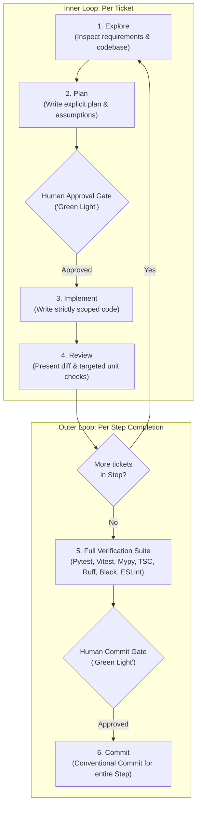

# The Standard Implementation Loop

This document defines the standard engineering development process and execution protocol. All development work strictly follows this structured, human-in-the-loop lifecycle.

---

## 1. Architectural Hierarchy

Work is organized into three distinct levels of granularity:

$$\textbf{Phase} \longrightarrow \textbf{Step} \longrightarrow \textbf{Ticket}$$

| Level | Definition | Execution & Review Cadence |
| :--- | :--- | :--- |
| **Phase** | High-level milestone representing a complete functional capability or architectural system. | Strategic planning & phase-level sign-off. |
| **Step** | A logical, cohesive grouping of related tickets that delivers a testable sub-system or feature increment. | **Verification Suite & Git Commit Gate** (executed once per step). |
| **Ticket** | The atomic unit of implementation (single model, algorithm, endpoint, UI component, or integration). | **Exploration, Planning, Implementation & Review Gate** (executed individually per ticket). |

---

## 2. The Development Lifecycle

The implementation lifecycle operates on two distinct loops: the **Inner Loop (Per-Ticket)** and the **Outer Loop (Per-Step)**.

---

## 3. Inner Loop: Per-Ticket Execution

Every individual ticket moves through Steps 1 through 4 sequentially. **Never skip or combine steps.**

### 1. Explore
- Read the assigned ticket definition, relevant architectural documentation, and governance rules (`CONSTITUTION.md`).
- Inspect existing codebase modules, data models, and interfaces to understand integration points.
- **Rule:** Do not write, edit, or modify any code during this step.

### 2. Plan
- Formulate a concise, explicit written plan:
  - Exact files to create, modify, or delete.
  - Technical approach, algorithms, and data structures.
  - Assumptions made and boundary conditions identified.
  - Targeted unit tests and assertions to write.
- **GATE 1 (Human Approval):** **STOP.** Present the plan to the human reviewer and wait for an explicit "green light" before writing any code.

### 3. Implement
- Once approved, write the code strictly necessary to fulfill the specific ticket.
- Write or update targeted unit tests covering happy paths and edge cases for the ticket.
- **Rule:** Maintain strict scope boundaries. No unsolicited refactoring, no tangential nice-to-haves, and no writing code for future tickets ahead of time.

### 4. Review
- Present a clear summary of the changes made for the ticket:
  - Modified files and key technical decisions.
  - Targeted unit test results.
- Obtain human feedback or confirmation before proceeding to the next ticket in the step.

---

## 4. Outer Loop: Per-Step Completion & Commit

Once **all tickets** belonging to a given Step have completed their individual review cycles, the process transitions to the Step-level verification and commit gates.

### 5. Full Verification Suite
Execute the project's complete automated quality assurance and verification pipeline:
1. **Backend Test Suite:** Run all unit and integration tests (`pytest`).
2. **Frontend Test Suite:** Run all component and interaction tests (`npm test` / `vitest run`).
3. **Static Type Safety:**
   - Python: Strict type validation (`mypy --strict`).
   - TypeScript: Compiler check without emission (`npx tsc --noEmit`).
4. **Code Style & Formatting:**
   - Python: Linting and formatting checks (`ruff check`, `black --check`).
   - TypeScript/React: Linting and formatting checks (`eslint`, `prettier`).

### 6. Commit
- Summarize the full step increment across all completed tickets.
- Draft a clean, descriptive commit message adhering to the **Conventional Commits** specification (`feat:`, `fix:`, `chore:`, `refactor:`, `test:`, `docs:`).
- **GATE 2 (Human Commit Approval):** **STOP.** Present the verification results and proposed commit message. Wait for explicit confirmation before committing.
- Commit the staged step changes to Git.

---

## 5. Principles & Rules of Engagement

1. **Human-in-the-Loop Supremacy:**
   - The human directs, reviews, and approves at every gate; the agent plans, executes, and verifies.
   - Never assume approval or bypass a review gate.

2. **Strict Scope Isolation:**
   - Implement exactly one ticket at a time.
   - If an adjacent issue, bug, or technical debt is discovered outside the current ticket scope, document it for later rather than improvising unapproved fixes.

3. **Constitution & Governance Invariance:**
   - Architectural principles, typing strictness, data egress constraints, and governance standards in `CONSTITUTION.md` are non-negotiable.
   - Conflicts between a ticket requirement and constitutional rules must be surfaced immediately.

4. **Dynamic Reference Context:**
   - All requirement specifications, architectural constraints, and ticket definitions are sourced directly from the active project documentation hierarchy (e.g., phase specifications, step plans, and ticket breakdowns).
