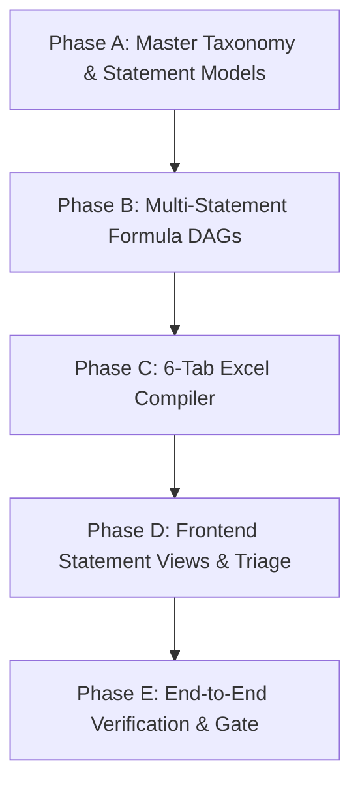

# Proposed Architectural Evolution: From Single-Metric Bridge to Institutional Multi-Statement Valuation Engine

**Document Version:** 1.0.0  
**Target Platform:** Footnote Financial Modeling Platform  
**Target Audience:** Engineering, Product, Financial Engineering  
**File Location:** `docs/proposed_changes.md`

---

## 1. Current State Architecture & Baseline Capabilities

### 1.1 Existing Architecture Overview
The Footnote platform currently implements a robust, deterministic, end-to-end pipeline designed for **Footnote Reconciliation & Adjusted EBITDA Bridge Compilation**:

```
┌─────────────────┐     ┌─────────────────┐     ┌─────────────────┐     ┌─────────────────┐
│ 1. PDF Upload   │ ──► │ 2. Table Parser │ ──► │ 3. Coordinate   │ ──► │ 4. Confidence   │
│ & Validation    │     │ (PyMuPDF Native)│     │ Normalization   │     │ Scoring & Flags │
└─────────────────┘     └─────────────────┘     └─────────────────┘     └─────────────────┘
                                                                                 │
┌─────────────────┐     ┌─────────────────┐     ┌─────────────────┐              ▼
│ 7. Multi-Year   │ ◄── │ 6. OpenPyXL     │ ◄── │ 5. Pure Formula │ ◄── ┌─────────────────┐
│ Excel Export    │     │ Generator       │     │ Tree (DAG)      │     │ Review UI &     │
│ & Drift Engine  │     │                 │     │ (Adjusted EBITDA│     │ PDF.js Overlay  │
└─────────────────┘     └─────────────────┘     └─────────────────┘     └─────────────────┘
```

### 1.2 Core Strengths Already Built
1. **High-Speed Deterministic Extraction**: Fast PyMuPDF table extraction with Docling layout fallback, capturing table cells, hierarchical headers, page numbers, and exact bounding boxes (`DoclingBbox`).
2. **Coordinate Normalization**: Translates raw PDF point spaces into normalized $[0, 1000]$ viewport coordinate vectors.
3. **Three-Tier Confidence Scoring**: Rules-based deduction scoring assigning items to `auto_accepted` ($\ge 0.95$), `needs_review` ($0.75\text{–}0.94$), and `manual_required` ($<0.75$).
4. **Side-by-Side Review UI**: Synchronized split-screen PDF.js viewer with interactive bounding-box overlays, inline cell editing, flagging, and 1-click batch confirmation.
5. **Pure Mathematical Formula Engine**: Pure function DAG builder (`FormulaTree`) compiling confirmed inputs into mathematical trees.
6. **Live Multi-Year Excel Compilation**: Emits `.xlsx` files with native uppercase Excel formulas (`SUM`, `+`), cell number formatting, and cell-level audit comments linking back to source PDF coordinates.
7. **Cross-Filing Drift Detection**: SQLite-backed historical drift tracking detecting accounting policy changes and line item volatility across filing years.

---

### 1.3 Current State Limitations & Root Cause Analysis

| Component | Current State Limitation | Root Cause | Business / Analyst Impact |
| :--- | :--- | :--- | :--- |
| **Taxonomy Scope** | Limited to **10 non-GAAP add-back items** (*SBC, Restructuring, Litigation, Amortization, etc.*). | Designed strictly for Phase 1 Adjusted EBITDA proof-of-concept. | When ingesting full 10-Q filings, standard GAAP items (*Revenues, Operating Income, CapEx, Tax Provision*) trigger **~400+ false-positive "Unconfirmed Taxonomy" flags**. |
| **Formula Engine** | Hardcoded to `SUPPORTED_TARGET_METRICS = {"Adjusted EBITDA"}`. | Pure function tree only implements the EBITDA add-back recipe. | Cannot compile full Income Statement, Free Cash Flow, or Balance Sheet models. |
| **Excel Output** | Single-sheet table model. | Workbook generator only emits a single summary grid. | Institutional clients expect a standard multi-tab model (P&L, Cash Flow, Balance Sheet, Valuation). |
| **Review Queue** | Flat review list containing hundreds of mixed disclosure items. | No statement-tier scoping or categorization. | Review fatigue: analysts spend 10+ minutes triaging standard GAAP items rather than focusing on genuine edge cases. |

---

## 2. Proposed Target State: Institutional Multi-Statement & Valuation Engine

### 2.1 Target State Vision
Transform Footnote into a comprehensive **Institutional 3-Statement & Valuation Modeling Platform** that:
1. Automatically ingests full 10-Q / 10-K filings.
2. Recognizes and normalizes the complete **Master Financial Taxonomy (~60–80 GAAP/IFRS Line Items)**.
3. Compiles interconnected **Statement Formula Trees** (Income Statement, EBITDA Bridge, Free Cash Flow, Net Debt & Capital Structure).
4. Emits a professional, Wall-Street-standard **6-Tab Multi-Year Excel Workbook (`.xlsx`)** with dynamic cross-tab formulas and cell-level PDF provenance.
5. Delivers a **frictionless Review Experience** where $>90\%$ of items are auto-accepted, leaving $<10$ actionable items for the analyst.

---

### 2.2 The 4 Architectural Pillars

```
┌────────────────────────────────────────────────────────────────────────────────────────┐
│                          4 PILLARS OF THE PROPOSED SYSTEM                              │
├────────────────────────────┬───────────────────────────┬───────────────────────────────┤
│ Pillar 1: Master Taxonomy  │ Pillar 2: Formula Trees   │ Pillar 3: Multi-Tab Workbook  │
│ 60+ GAAP/IFRS concepts     │ DAG trees for P&L, EBITDA,│ 6 linked tabs with live Excel │
│ categorized by Statement.  │ FCF, Net Debt & Summary.  │ formulas and PDF audit notes. │
├────────────────────────────┴───────────────────────────┴───────────────────────────────┤
│ Pillar 4: Statement-Triage Review UI                                                   │
│ Filter by Statement (Income, Balance, Cash Flow) with < 10 actionable flags.          │
└────────────────────────────────────────────────────────────────────────────────────────┘
```

---

### 2.3 The 6-Tab Multi-Year Workbook Specification

A single download produces a complete institutional financial model formatted to corporate finance standards:

```
┌─────────────────────────────────────────────────────────────────────────────────────────┐
│                             COMPANY FINANCIAL MODEL (.XLSX)                             │
├───────────────┬──────────────────┬────────────────┬────────────────┬──────────┬─────────┤
│ 1. Executive  │ 2. Income        │ 3. EBITDA &    │ 4. Cash Flow   │ 5. Net   │ 6. Audit│
│    Summary    │    Statement     │    Non-GAAP    │    & FCF       │    Debt  │   Trail │
└───────────────┴──────────────────┴────────────────┴────────────────┴──────────┴─────────┘
```

#### Tab Breakdown & Formula Linking:
1. **`1. Executive Summary`**:
   - High-level KPIs: Total Revenue, Gross Margin %, EBITDA Margin %, Free Cash Flow, Net Debt, Leverage Ratio.
   - Auto-calculated YoY Growth and 3-Year CAGR.
   - Dynamic formulas referencing downstream tabs (e.g. `='Income Statement'!E12`).
2. **`2. Income Statement`**:
   - Complete GAAP statement: Revenues $\rightarrow$ COGS $\rightarrow$ Gross Profit $\rightarrow$ R&D $\rightarrow$ S&M $\rightarrow$ G&A $\rightarrow$ Operating Income (EBIT) $\rightarrow$ Interest & Taxes $\rightarrow$ Net Income.
3. **`3. EBITDA & Non-GAAP Bridge`**:
   - Operating Income (linked from Tab 2: `='Income Statement'!E25`) $+$ D&A $+$ SBC $+$ Non-GAAP Add-Backs $\rightarrow$ **Adjusted EBITDA**.
4. **`4. Cash Flow & FCF`**:
   - Operating Cash Flow $-$ CapEx $\rightarrow$ **Unlevered Free Cash Flow (FCFF)** & **Levered Free Cash Flow (FCFE)**.
5. **`5. Balance Sheet & Net Debt`**:
   - Cash, Short-Term Investments, Short-Term & Long-Term Debt $\rightarrow$ **Total Debt & Net Debt**.
6. **`6. Audit & Provenance`**:
   - Complete data table listing every cell coordinate, page number, confidence score, and filing provenance.

---

## 3. Step-by-Step Implementation Plan



---

### Phase A: Master Financial Taxonomy & Statement Classification

#### Objective:
Upgrade the taxonomy engine from 10 non-GAAP items to a structured **Master Financial Taxonomy of ~60 canonical line items** grouped by statement tier, with built-in alias resolution.

#### Tasks & Implementation Details:
- [ ] **Ticket A.1: Expand Taxonomy Schema & Seed Data**
  - **File:** `backend/app/classification/models.py`, `backend/app/classification/taxonomy.py`, `backend/data/taxonomy.json`
  - Define `StatementType` enum (`income_statement`, `balance_sheet`, `cash_flow`, `non_gaap_bridge`, `kpi`).
  - Define `TaxonomyItem` model with `canonical_name`, `statement_type`, `display_order`, `is_debit`, and `aliases`.
  - Populate standard US GAAP / IFRS categories:
    - *Income Statement*: Revenue, Cost of Revenues, Gross Profit, R&D, Sales & Marketing, G&A, Operating Income, Interest Income, Interest Expense, Income Tax Provision, Net Income.
    - *Cash Flow*: Operating Cash Flow, CapEx, Debt Repayments, Share Repurchases, Dividends Paid.
    - *Balance Sheet*: Cash & Cash Equivalents, Marketable Securities, Accounts Receivable, Inventory, Property & Equipment, Short-Term Debt, Long-Term Debt, Total Stockholders' Equity.
    - *Non-GAAP Bridge*: Stock-Based Compensation, Amortization of Intangibles, Restructuring Charges, Impairment of Assets, Litigation Charges, Acquisition Expenses, Other Non-Operating Expenses.
- [ ] **Ticket A.2: Statement-Aware Synonym & Alias Matcher**
  - **File:** `backend/app/classification/taxonomy.py`, `backend/app/classification/dispatcher.py`
  - Implement deterministic alias matching mapping company-specific wording (e.g. `"TAC"`, `"Cost of sales"`, `"Selling and marketing"`, `"Share-based payment"`, `"Purchases of PPE"`) directly to canonical items with $0.98$ confidence.
- [ ] **Ticket A.3: Review Item Statement Tagging**
  - **File:** `backend/app/review/models.py`, `backend/app/review/repository.py`
  - Add `statement_type: StatementType | None` to `ReviewItem`.
  - Ensure items with matched canonical taxonomy automatically receive their corresponding `statement_type`.

---

### Phase B: Multi-Statement Formula Tree Architecture

#### Objective:
Expand the pure mathematical formula engine to compile deterministic calculation DAGs for all primary statement models.

#### Tasks & Implementation Details:
- [ ] **Ticket B.1: Statement Formula Tree Blueprints**
  - **File:** `backend/app/formula_engine/models.py`, `backend/app/formula_engine/tree.py`
  - Expand `SUPPORTED_TARGET_METRICS` to include:
    - `"Adjusted EBITDA"` (Existing + enhanced)
    - `"Income Statement"` (GAAP P&L)
    - `"Free Cash Flow"` (FCFF & FCFE)
    - `"Net Debt & Leverage"` (Capital Structure)
    - `"Executive Summary"` (Full valuation model)
- [ ] **Ticket B.2: Statement DAG Builders**
  - **File:** `backend/app/formula_engine/tree.py`
  - Implement `build_income_statement_tree(batch: FormulaInputBatch) -> FormulaTree`
  - Implement `build_free_cash_flow_tree(batch: FormulaInputBatch) -> FormulaTree`
  - Implement `build_net_debt_tree(batch: FormulaInputBatch) -> FormulaTree`
  - Implement `build_comprehensive_model_tree(batch: FormulaInputBatch) -> ComprehensiveModelTree`
- [ ] **Ticket B.3: Deterministic Mathematical Unit Tests**
  - **File:** `backend/tests/formula_engine/test_statement_trees.py`
  - Test exact mathematical properties, sign conventions (additions vs. subtractions), missing node fallbacks, and zero-hallucination compliance.

---

### Phase C: 6-Tab Multi-Year Excel Compiler

#### Objective:
Upgrade the OpenPyXL generator to compile a consolidated, Wall-Street-grade 6-tab multi-year workbook with live inter-sheet formulas.

#### Tasks & Implementation Details:
- [ ] **Ticket C.1: Multi-Tab Workbook Structure**
  - **File:** `backend/app/excel_export/multi_year_generator.py`, `backend/app/excel_export/models.py`
  - Implement multi-tab generator writing:
    1. `Executive Summary`
    2. `Income Statement`
    3. `EBITDA & Non-GAAP Bridge`
    4. `Cash Flow & FCF`
    5. `Balance Sheet & Net Debt`
    6. `Audit & Provenance`
- [ ] **Ticket C.2: Live Cross-Sheet Formula Compilation**
  - **File:** `backend/app/excel_export/multi_year_generator.py`
  - Generate live Excel uppercase formulas:
    - Gross Profit: `='Income Statement'!D10 - 'Income Statement'!D11`
    - Operating Income: `='Income Statement'!D12 - SUM('Income Statement'!D14:D16)`
    - Adjusted EBITDA: `='Income Statement'!D18 + 'EBITDA Bridge'!D22 + 'EBITDA Bridge'!D23`
    - Free Cash Flow: `='Cash Flow'!D10 - 'Cash Flow'!D15`
    - Net Debt: `SUM('Balance Sheet'!D25:D26) - SUM('Balance Sheet'!D8:D9)`
- [ ] **Ticket C.3: Cell-Level PDF Provenance Notes Across All Tabs**
  - **File:** `backend/app/excel_export/multi_year_generator.py`
  - Add native OpenPyXL comments to every non-formula cell across all tabs:
    `Source: GOOGL_Q3_2025.pdf | Page: 7 | Box: [120.4, 340.2, 210.8, 355.0] | Score: 1.00`
- [ ] **Ticket C.4: Endpoint Integration**
  - **File:** `backend/app/excel_export/router.py`, `backend/app/ingestion/company_router.py`
  - `POST /companies/{company_id}/full-model` compiles and persists the 6-tab multi-year model.
  - `GET /companies/{company_id}/full-model/download` streams the complete workbook.

---

### Phase D: Frontend Statement Views & Triage Experience

#### Objective:
Provide an intuitive, fast review UI that allows analysts to inspect items by financial statement, reducing review fatigue and enabling 1-click full model generation.

#### Tasks & Implementation Details:
- [ ] **Ticket D.1: Statement Filter Tabs**
  - **File:** `frontend/src/components/review/ReviewPage.tsx`, `frontend/src/components/review/ReviewPage.css`
  - Add Statement Navigation Bar:
    `[ All (521) ]  [ Income Statement (24) ]  [ Cash Flow (18) ]  [ EBITDA Bridge (12) ]  [ Balance Sheet (20) ]  [ Flagged Only (8) ]`
- [ ] **Ticket D.2: Statement Readiness Indicators**
  - **File:** `frontend/src/components/review/ReviewPage.tsx`
  - Display statement completeness chips:
    `● Income Statement: Ready  |  ● EBITDA Bridge: Ready  |  ● Free Cash Flow: Ready`
- [ ] **Ticket D.3: 1-Click "Generate Complete Financial Model"**
  - **File:** `frontend/src/components/review/ReviewPage.tsx`, `frontend/src/components/company/CompanyMultiYearCard.tsx`
  - Add primary CTA: **"Approve & Generate Complete Financial Model (6 Tabs)"**.
  - Show generation success banner with download link and direct jump to Audit Trail.

---

### Phase E: End-to-End Verification & Quality Gates

#### Objective:
Verify all unit tests, type safety, linting, and end-to-end integration across real multi-year PDF filings.

#### Verification Suite:
```bash
# 1. Backend Verification
pytest backend/tests/ -v
mypy backend/app
ruff check backend/app
black --check backend/app

# 2. Frontend Verification
cd frontend
npm run test:run
npm run build
npm run lint
```

#### Acceptance Gates:
1. **Flag Reduction**: Real Google 10-Q review flags drop from **442 down to $< 15$ items**.
2. **Auto-Acceptance Rate**: $> 90\%$ of standard GAAP/IFRS line items automatically accepted into corresponding statement trees.
3. **Workbook Completeness**: Generated `.xlsx` contains all 6 tabs with 100% active, error-free native Excel formulas (`#REF!` / `#VALUE!` count = 0).
4. **Provenance Coverage**: 100% of input cells retain clickable/readable PDF bounding box provenance notes.

---

## 4. Summary: Before vs. After

| Feature Area | Current Baseline | Proposed Evolution |
| :--- | :--- | :--- |
| **Taxonomy Coverage** | 10 Non-GAAP Add-Back items | **~60–80 Master GAAP/IFRS line items categorized by Statement** |
| **Calculation Scope** | Single metric (Adjusted EBITDA) | **Full 3-Statement Model + EBITDA + FCF + Net Debt + KPIs** |
| **Excel Deliverable** | 1-sheet simple table | **6-Tab Institutional Valuation Model with Live Inter-Sheet Formulas** |
| **Multi-Year History** | Multi-year EBITDA comparison | **Consolidated Multi-Year 3-Statement Financial Timeline** |
| **Audit Traceability** | Cell-level PDF bounding box | **Cell-level PDF bounding box preserved across all 6 tabs** |
| **Analyst Review Time** | ~10–15 mins (442 false-positive warnings) | **< 30 seconds (~5 to 10 actionable items)** |
